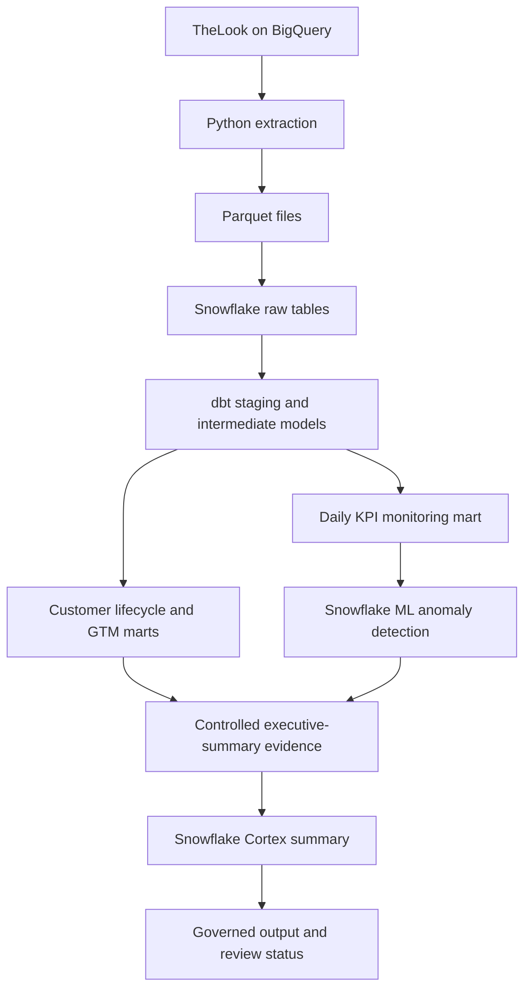

# CortexEcommerce

CortexEcommerce is an end-to-end eCommerce analytics and AI-governance project built on Snowflake and dbt. It transforms TheLook event and transaction data into tested customer-lifecycle and go-to-market (GTM) marts, detects unusual KPI behavior with Snowflake ML, and generates traceable executive summaries with Snowflake Cortex.

## Project status

| Area | Status | Current implementation |
|---|---|---|
| Data ingestion | Complete | Python extraction from BigQuery and loading into Snowflake, using Parquet as the intermediate format |
| Analytics engineering | Complete | Staging, intermediate, core, customer-lifecycle, GTM, and monitoring models in dbt |
| Data quality | Complete | Source, relationship, uniqueness, accepted-value, range, and not-null tests |
| KPI anomaly detection | Complete | Multi-series Snowflake ML anomaly detection with persisted results and documented series exclusions |
| Cortex executive summaries | Complete | Evidence input, versioned prompt, generated output, model metadata, timestamp, and review status are persisted |
| Technical AI validation | Complete | SQL checks for completeness, identifiers, reporting periods, metadata, review statuses, and output length |
| Human grounding review | In progress | Formal claim-by-claim evidence review and approval/rejection recording still need to be implemented |
| Streamlit application | Planned | Interactive KPI, anomaly, evidence, and human-review interface |

## Business questions

The analytical layer is designed to answer questions such as:

- Which acquisition channels generate traffic, conversions, repeat customers, and revenue?
- Where do users drop out of the browse-to-purchase funnel?
- Which customer segments contribute the most value?
- How does retention change across acquisition cohorts?
- Which products, categories, brands, and geographies perform best?
- Which daily business KPIs fall outside their expected ranges?
- Can an executive summary be generated from controlled evidence and retained for review?

## Architecture



## Data

The project uses the public TheLook eCommerce dataset, including users, orders, order items, products, inventory, distribution centers, and website events.

The source supports behavioral funnel analysis alongside transactional, customer, product, channel, cohort, and geographic analysis.

## Analytics layers

### Staging

Seven Snowflake source tables are cleaned and standardized through dbt staging models. Rejected order-item records are isolated explicitly instead of being silently discarded.

### Intermediate and core

- `int_customer_orders`: reusable customer-order metrics
- `int_session_funnel`: session-level funnel and abandonment behavior
- `dim_customer`: customer dimension enriched with lifecycle attributes

### Customer lifecycle marts

- `mart_customer_360`
- `mart_customer_rfm`
- `mart_customer_segment_summary`

### GTM marts

- `mart_acquisition_channel_performance`
- `mart_conversion_funnel`
- `mart_customer_cohort_retention`
- `mart_geographic_performance`
- `mart_gtm_channel_summary`
- `mart_product_performance`

### Monitoring and AI governance

- `mart_daily_business_kpis`: daily operational KPI layer
- `int_kpi_anomaly_input`: training/scoring input for multiple KPI series
- `KPI_ANOMALY_RESULTS`: persisted forecasts, prediction intervals, and anomaly flags
- `KPI_ANOMALY_EXCLUSIONS`: auditable list of KPI series skipped during scoring
- `EXECUTIVE_SUMMARY_INPUT`: controlled, non-PII evidence supplied to Cortex
- `EXECUTIVE_SUMMARIES`: generated narratives with prompt, model, version, timestamp, and review status

## AI and ML workflow

1. dbt produces the daily KPI monitoring mart.
2. The KPI input is separated into chronological training and scoring periods.
3. Snowflake ML fits a multi-series anomaly detector and scores future observations.
4. Scored anomalies and exclusions are persisted in the governance schema.
5. SQL assembles a constrained evidence package from KPIs and anomaly results.
6. Snowflake Cortex generates an executive summary with `llama3.1-8b`.
7. The prompt, response, model, versions, generation timestamp, and `PENDING_REVIEW` status are stored.
8. Technical SQL and dbt checks validate structure and metadata.
9. A formal human grounding review remains the next governance step before an output can be approved.

The generated narrative is therefore treated as a reviewable analytical artifact, not automatically as verified truth.

## Technology stack

### Implemented

- Snowflake
- dbt Core with `dbt-snowflake` and `dbt-utils`
- SQL
- Python
- BigQuery client libraries
- Parquet
- Snowflake ML anomaly detection
- Snowflake Cortex AI functions
- Git and GitHub

### Planned extensions

- Streamlit for interactive analytics and human review
- Snowpark for application-side transformations or model workflows
- Purchase-propensity and customer-risk models
- Automated claim-to-evidence validation
- CI/CD and scheduled orchestration

## Repository structure

```text
.
├── cortex_ecommerce/
│   ├── macros/
│   ├── models/
│   │   ├── governance/
│   │   ├── intermediate/
│   │   ├── marts/
│   │   └── staging/
│   ├── snowflake/
│   │   ├── cortex/
│   │   └── ml/
│   ├── dbt_project.yml
│   └── packages.yml
├── scripts/
│   ├── extract_thelook.py
│   ├── load_thelook_to_snowflake.py
│   └── test_bigquery_connection.py
└── requirements.txt
```

## Running the project

### Prerequisites

- Python environment with the packages in `requirements.txt`
- Google Cloud credentials with access to the public TheLook dataset
- Snowflake account, warehouse, database, schemas, and project role
- dbt profile named `cortex_ecommerce`

Keep credentials outside Git. The repository does not require `profiles.yml`, passwords, private keys, or service-account files to be committed.

### Build and test the dbt project

```bash
cd cortex_ecommerce
dbt deps
dbt debug
dbt build
```

### Run Snowflake AI workflows

After the dbt build succeeds, run the scripts in this order:

1. `snowflake/ml/prepare_anomaly_data.sql`
2. `snowflake/ml/train_kpi_anomaly_detector.sql`
3. `snowflake/ml/score_kpi_anomalies.sql`
4. `snowflake/ml/kpi_anomaly_exclusions.sql`
5. `snowflake/ml/validate_anomaly_results.sql`
6. `snowflake/cortex/create_executive_summary_input.sql`
7. `snowflake/cortex/generate_executive_summary.sql`
8. `snowflake/cortex/validate_ai_output.sql`

## Known limitations

- One KPI series was skipped during anomaly scoring after a series-specific Snowflake ML error; the exclusion is captured for auditability.
- Passing structural validation does not prove that every generated statement is supported by the evidence.
- Formal human grounding review has not yet been completed or recorded.
- The Streamlit presentation and review layer has not yet been built.
- The current workflow is manually executed rather than orchestrated on a production schedule.

## Next milestone

The next milestone is a governed human-review workflow that:

1. presents each generated claim beside its supporting KPI or anomaly evidence;
2. records reviewer notes and an `APPROVED` or `REJECTED` decision;
3. prevents an unreviewed or inaccurate summary from being presented as trusted output;
4. exposes the workflow through Streamlit.
