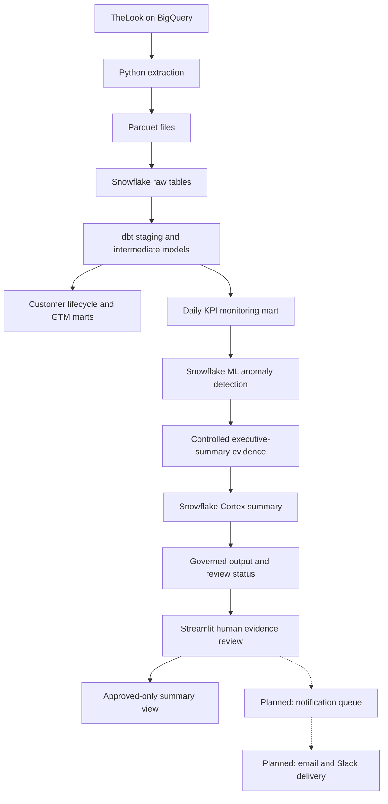

# CortexEcommerce

CortexEcommerce is an end-to-end eCommerce analytics and AI-governance project built on Snowflake and dbt. It transforms TheLook event and transaction data into tested customer-lifecycle and go-to-market (GTM) marts, detects unusual KPI behavior with Snowflake ML, and generates traceable executive summaries with Snowflake Cortex.

## Project status

| Area | Status | Current implementation |
|---|---|---|
| Data ingestion | Complete | Python extraction from BigQuery and loading into Snowflake, using Parquet as the intermediate format |
| Analytics engineering | Complete | Staging, intermediate, core, customer-lifecycle, GTM, and monitoring models in dbt |
| Data quality | Complete | Source, relationship, uniqueness, accepted-value, range, and not-null tests |
| KPI anomaly detection | Complete | Multi-series Snowflake ML anomaly detection with persisted results and documented series exclusions |
| Cortex executive summaries | Complete | Evidence input, versioned prompt, generated output, model metadata, timestamp, and review status are persisted |
| Technical AI validation | Complete | SQL checks for completeness, identifiers, reporting periods, metadata, review statuses, and output length |
| Human grounding review | Implemented locally | Reviewers compare responses with stored evidence and save decisions and metadata to the source table; review columns require provisioning |
| Streamlit application | Implemented locally | Summary selection, evidence display, approval/rejection, and optional KPI/anomaly CSV exploration |
| Stakeholder notifications | Planned | Email and Slack delivery after approval, with delivery tracking and retries |

## Business questions

The analytical layer is designed to answer questions such as:

- Which acquisition channels generate traffic, conversions, repeat customers, and revenue?
- Where do users drop out of the browse-to-purchase funnel?
- Which customer segments contribute the most value?
- How does retention change across acquisition cohorts?
- Which products, categories, brands, and geographies perform best?
- Which daily business KPIs fall outside their expected ranges?
- Can an executive summary be generated from controlled evidence and retained for review?

## Architecture


```mermaid
flowchart TD
    A["TheLook on BigQuery"] --> B["Python extraction"]
    B --> C["Parquet files"]
    C --> D["Snowflake raw tables"]
    D --> E["dbt staging and intermediate models"]
    E --> F["Customer lifecycle and GTM marts"]
    E --> G["Daily KPI monitoring mart"]
    G --> H["Snowflake ML anomaly detection"]
    H --> I["Controlled executive-summary evidence"]
    I --> J["Snowflake Cortex summary"]
    J --> K["Governed output and review status"]
    K --> L["Streamlit human evidence review"]
    L --> M["Approved-only summary view"]
    L -.-> N["Planned: notification queue"]
    N -.-> O["Planned: email and Slack delivery"]
```

## Data

The project uses the public TheLook eCommerce dataset, including users, orders, order items, products, inventory, distribution centers, and website events.

The source supports behavioral funnel analysis alongside transactional, customer, product, channel, cohort, and geographic analysis.

## Analytics layers

### Staging

Seven Snowflake source tables are cleaned and standardized through dbt staging models. Rejected order-item records are isolated explicitly instead of being silently discarded.

### Intermediate and core

- `int_customer_orders`: reusable customer-order metrics
- `int_session_funnel`: session-level funnel and abandonment behavior
- `dim_customer`: customer dimension enriched with lifecycle attributes

### Customer lifecycle marts

- `mart_customer_360`
- `mart_customer_rfm`
- `mart_customer_segment_summary`

### GTM marts

- `mart_acquisition_channel_performance`
- `mart_conversion_funnel`
- `mart_customer_cohort_retention`
- `mart_geographic_performance`
- `mart_gtm_channel_summary`
- `mart_product_performance`

### Monitoring and AI governance

- `mart_daily_business_kpis`: daily operational KPI layer
- `int_kpi_anomaly_input`: training/scoring input for multiple KPI series
- `KPI_ANOMALY_RESULTS`: persisted forecasts, prediction intervals, and anomaly flags
- `KPI_ANOMALY_EXCLUSIONS`: auditable list of KPI series skipped during scoring
- `EXECUTIVE_SUMMARY_INPUT`: controlled, non-PII evidence supplied to Cortex
- `EXECUTIVE_SUMMARIES`: incremental narrative history with input hash, prompt, model, version, timestamp, and review status
- `APPROVED_EXECUTIVE_SUMMARIES`: view exposing only rows marked `APPROVED`, including reviewer metadata

## AI and ML workflow

1. dbt produces the daily KPI monitoring mart.
2. The KPI input is separated into chronological training and scoring periods.
3. Snowflake ML fits a multi-series anomaly detector and scores future observations.
4. Scored anomalies and exclusions are persisted in the governance schema.
5. SQL assembles a constrained evidence package from KPIs and anomaly results.
6. The `executive_summaries` dbt model calls Snowflake Cortex with `llama3.3-70b` for inputs not already stored with the same input hash, model, and prompt version.
7. The prompt, response, model, versions, generation timestamp, and `PENDING_REVIEW` status are stored.
8. Technical SQL and dbt checks validate structure and metadata.
9. A human reviews claims against the evidence and records a review decision.
10. The `approved_executive_summaries` view exposes only approved outputs once its required review metadata columns are available.

The generated narrative is therefore treated as a reviewable analytical artifact, not automatically as verified truth.

## Technology stack

### Implemented

- Snowflake
- dbt Core with `dbt-snowflake` and `dbt-utils`
- SQL
- Python
- BigQuery client libraries
- Parquet
- Snowflake ML anomaly detection
- Snowflake Cortex AI functions
- Streamlit for local human review and CSV exploration
- Git and GitHub

### Planned extensions

- Email and Slack notifications for approved summaries
- Review audit history and authenticated reviewer identity
- Snowpark for application-side transformations or model workflows
- Purchase-propensity and customer-risk models
- Automated claim-to-evidence validation
- CI/CD and scheduled orchestration

## Repository structure

```text
.
├── cortex_ecommerce/
│   ├── macros/
│   ├── models/
│   │   ├── governance/
│   │   ├── intermediate/
│   │   ├── marts/
│   │   └── staging/
│   ├── snowflake/
│   │   ├── cortex/
│   │   └── ml/
│   ├── dbt_project.yml
│   └── packages.yml
├── scripts/
│   ├── extract_thelook.py
│   ├── load_thelook_to_snowflake.py
│   └── test_bigquery_connection.py
└── requirements.txt
```

## Running the project

### Prerequisites

- Python environment with the packages in `requirements.txt`
- Google Cloud credentials with access to the public TheLook dataset
- Snowflake account, warehouse, database, schemas, and project role
- dbt profile named `cortex_ecommerce`

Keep credentials outside Git. The repository does not require `profiles.yml`, passwords, private keys, or service-account files to be committed.

### Set Snowflake credentials in PowerShell

Run these commands in the same terminal you will use for dbt. Replace the
account and username placeholders with your Snowflake values:

```powershell
$env:SNOWFLAKE_ACCOUNT = "YOUR_ORG-YOUR_ACCOUNT"
$env:SNOWFLAKE_USER = "YOUR_USERNAME"

$keyPassphrase = Read-Host "Private-key passphrase" -AsSecureString
$env:SNOWFLAKE_PRIVATE_KEY_PASSPHRASE = [System.Net.NetworkCredential]::new("", $keyPassphrase).Password
Remove-Variable keyPassphrase
```

Enter the passphrase for your private-key file, not your Snowflake login
password. In your local `~/.dbt/profiles.yml`, the existing output configuration
should include these fields (replace the key path):

```yaml
account: "{{ env_var('SNOWFLAKE_ACCOUNT') }}"
user: "{{ env_var('SNOWFLAKE_USER') }}"
private_key_path: 'C:/Users/YOUR_WINDOWS_USER/.dbt/rsa_key_new.p8'
private_key_passphrase: "{{ env_var('SNOWFLAKE_PRIVATE_KEY_PASSPHRASE') }}"
```

The matching public key must already be registered on your Snowflake user.
From the repository root, activate the environment and check the connection:

```powershell
.\.venv\Scripts\Activate.ps1
dbt debug --project-dir cortex_ecommerce
```

These variables apply only to this terminal session and processes launched
from it. Repeat the commands in a new terminal. The hidden prompt keeps the
passphrase out of command history; never save actual credentials in Git.

For the Python loader, set the Snowflake login password separately:

```powershell
$loginPassword = Read-Host "Snowflake login password for the loader" -AsSecureString
$env:SNOWFLAKE_PASSWORD = [System.Net.NetworkCredential]::new("", $loginPassword).Password
Remove-Variable loginPassword
```

The loader uses password authentication; dbt uses the configured private key.

### Build and test the dbt project

```bash
cd cortex_ecommerce
dbt deps
dbt debug
dbt build --exclude tag:post_training
```

### Run Snowflake AI workflows

The initial dbt build creates the ML training and scoring inputs in `ML`.
Then run these steps in order from the dbt project directory:

1. Run `snowflake/ml/train_kpi_anomaly_detector.sql` in Snowflake to train `ML.KPI_ANOMALY_DETECTOR_V2`. Its grant step requires an administrative role.
2. Run `dbt build --select tag:post_training --exclude tag:summary_generation tag:summary_publication` to create `AI_GOVERNANCE.KPI_ANOMALY_RESULTS`, `KPI_ANOMALY_EXCLUSIONS`, and `EXECUTIVE_SUMMARY_INPUT` in dependency order.
3. Run `snowflake/ml/validate_anomaly_results.sql` manually in Snowflake.
4. Run `dbt run --select executive_summaries` to generate and store the executive summary.
5. Run `snowflake/cortex/validate_ai_output.sql` manually in Snowflake after generation.
6. After provisioning review metadata and recording human review decisions (see below), run `dbt build --select approved_executive_summaries` to create and test the approved-only view.

Training is external to dbt's model graph; the scoring model requires the trained
object in the target database's `ML` schema. The standalone Snowflake scripts
use `CORTEX_ECOMMERCE`, so use that database in the dbt target for this workflow.
Rebuild inputs and rerun training before scoring when refreshing the detector.
Validation scripts remain manual and are not executed by dbt.

`models/governance/executive_summaries.sql` serializes the input model's
`cortex_input` as JSON using prompt version `v2.0` and `llama3.3-70b`.
The prompt distinguishes model expectations from prior-period comparisons,
uses KPI `desired_direction`, and requires anomaly evidence citations.

The model appends new summaries and preserves earlier review statuses. On
incremental runs, it skips an input when its `input_hash`, `model_name`, and
`prompt_version` already exist. New rows use `PENDING_REVIEW`; full refresh is
disabled to preserve history. Bump `prompt_version` when changing the prompt
so existing inputs can be regenerated under the new version.

A general `dbt run` or `dbt build` includes generation and publication. Exclude
`tag:summary_generation tag:summary_publication` when building only upstream
models. To refresh the input and generate a summary together, run:

```bash
dbt run --select executive_summary_input executive_summaries
```

Run these commands from `cortex_ecommerce/`. From the repository root, add
`--project-dir cortex_ecommerce` to the dbt command. Credentials must be set
in the terminal running dbt. Validation SQL remains manual in `snowflake/`.

### Human review and approved publication

`approved_executive_summaries` is a view over `executive_summaries` filtered to
`review_status = 'APPROVED'`. Pending, rejected, and any other statuses are
excluded. The view does not approve summaries or perform grounding checks.
Reviewers must verify the narrative against the stored evidence before recording
approval. Once the view exists, changes to review status are reflected without
regenerating summaries.

The Streamlit app updates the selected `summary_id` directly in the configured
`EXECUTIVE_SUMMARIES` source table. It saves `review_status`, `reviewed_by`,
`reviewed_at`, and `review_notes`, preserving the generated response text.
The save commits only when exactly one matching record is updated; stale or
nonunique records cause a rollback. Review metadata represents the latest
decision; a separate history of all review decisions is not yet implemented.

The current `executive_summaries` model does not create the review metadata
columns. Before using the app or building the approved view, provision these
columns on the existing history table using its owner role. Adjust the database
and schema to match your deployment:

```sql
ALTER TABLE CORTEX_ECOMMERCE.AI_GOVERNANCE.EXECUTIVE_SUMMARIES
    ADD COLUMN IF NOT EXISTS REVIEWED_BY VARCHAR;
ALTER TABLE CORTEX_ECOMMERCE.AI_GOVERNANCE.EXECUTIVE_SUMMARIES
    ADD COLUMN IF NOT EXISTS REVIEWED_AT TIMESTAMP_NTZ;
ALTER TABLE CORTEX_ECOMMERCE.AI_GOVERNANCE.EXECUTIVE_SUMMARIES
    ADD COLUMN IF NOT EXISTS REVIEW_NOTES VARCHAR;
```

Existing history tables also need `input_hash` before the incremental generation
query can use its deduplication check.

The review-status documentation currently includes `NEEDS_REVISION` in one
place, while the original accepted-values test and manual validation still
allow only `PENDING_REVIEW`, `APPROVED`, and `REJECTED`. Align those checks before
using `NEEDS_REVISION` as a stored status.

### Run the Streamlit review app

The app uses `streamlit/.streamlit/secrets.toml`, which is ignored by Git.
It does not read your dbt profile or the Snowflake environment variables shown
above. Create the file with your connection settings; for key-pair login:

```toml
[snowflake]
account = "YOUR_ORG-YOUR_ACCOUNT"
user = "YOUR_USERNAME"
warehouse = "YOUR_WAREHOUSE"
database = "CORTEX_ECOMMERCE"
schema = "AI_GOVERNANCE"
role = "YOUR_REVIEW_ROLE"
private_key_file = "C:/Users/YOUR_WINDOWS_USER/.dbt/rsa_key_new.p8"
private_key_file_pwd = "YOUR_PRIVATE_KEY_PASSPHRASE"
summary_table = "CORTEX_ECOMMERCE.AI_GOVERNANCE.EXECUTIVE_SUMMARIES"
```

Use the connection values from your working dbt configuration. The review role
needs warehouse, database, and schema USAGE plus SELECT and UPDATE on the source
table. Keep credentials and private keys outside version control.

From the repository root in PowerShell:

```powershell
.\.venv\Scripts\python.exe -m pip install -r streamlit/requirements.txt
Set-Location streamlit
..\.venv\Scripts\python.exe -m streamlit run app.py
```

Open http://localhost:8501. Use the Streamlit runner rather than running
`app.py` directly; direct execution does not provide Streamlit session state.
Press Ctrl+C in the terminal to stop the server.

1. Select a `PENDING_REVIEW` summary.
2. Compare the generated response with the stored prompt and evidence.
3. Enter your reviewer name and notes, choose `APPROVED` or `REJECTED`, and
   confirm that you checked the evidence.
4. Click **Save review to Snowflake** to update the source record.
5. Change the status filter to revisit the saved decision.

Optional KPI and anomaly CSV uploads support additional exploration. The app
reviews existing responses; generate new responses through the dbt workflow.
See [the Streamlit README](streamlit/README.md) for additional authentication options.

### Stakeholder delivery (planned)

Approval currently updates Snowflake and makes the record available through the
approved-only view once built. It does not send email or Slack messages.

The planned delivery workflow is:

1. Save the approval, append a review-history record, and queue email and Slack
   notifications in one database transaction.
2. Have a separate worker deliver the approved summary, reporting period, and
   reviewer information to configured stakeholder recipients and a Slack channel.
3. Track each channel's delivery status, attempts, and errors independently;
   retry failures without undoing approval or resending confirmed deliveries.
4. Show delivery status in Streamlit. Use an approval-event identifier for
   deduplication and handle ambiguous delivery outcomes explicitly.

Email service, recipients, Slack integration, and worker scheduling still need
configuration and implementation. Store integration credentials outside Git.

## Known limitations

- One KPI series was skipped during anomaly scoring after a series-specific Snowflake ML error; the exclusion is captured for auditability.
- Passing structural validation does not prove that every generated statement is supported by the evidence.
- Review metadata columns require the manual provisioning step above; fresh dbt builds do not create them.
- Reviewer names are self-reported. The local app has no authenticated reviewer identity or stakeholder access controls.
- New generated summaries are appended to the history table. Re-reviewing an existing summary updates its review metadata in place; earlier decisions for that same summary are not retained. An append-only review audit table is planned.
- Evidence is displayed as the stored prompt rather than a structured claim-by-claim evidence interface.
- Email and Slack notifications, delivery tracking, and retries are not yet implemented.
- The current workflow is manually executed rather than orchestrated on a production schedule.

## Improvement roadmap

| Priority | Improvement | Intended outcome |
|---|---|---|
| 1 | Approval-to-delivery workflow | Deliver email and Slack notifications, track results, and retry failures |
| 2 | Review decision history | Retain previous decisions when an existing summary is reviewed again; the latest decision and reviewer metadata are already saved |
| 3 | Reviewer authentication | Associate decisions with verified users and restrict review access |
| 4 | Structured evidence display | Show KPI changes, anomaly charts, and evidence IDs beside summary claims |
| 5 | Summary quality evaluation | Check numerical accuracy, citations, unsupported claims, and reporting periods |
| 6 | Scheduled pipeline | Automate data refresh, dbt checks, scoring, and generation with failure handling |
| 7 | Operational monitoring | Track stale data, failed runs, pending reviews, notification failures, and Cortex costs |
| 8 | CI and reproducible setup | Validate changes and provision required schemas consistently |

The next milestone is to approve one summary, preserve its review history,
deliver email and Slack notifications, and display delivery status in Streamlit.
